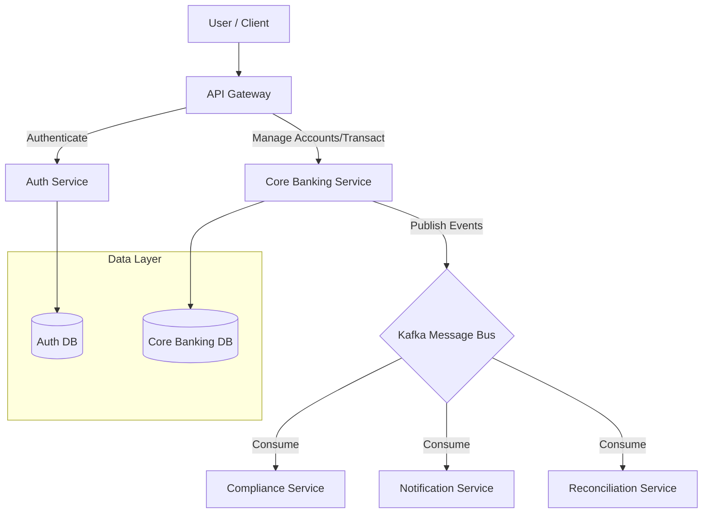

# Service Interaction & Architecture

## System Overview
The Payment Orchestration Platform is built on a microservices architecture, communicating via REST APIs (synchronous) and Kafka (asynchronous).

## Interaction Flows

### 1. User Registration Flow
1. **User** sends `POST /auth/register` to **API Gateway**.
2. **Gateway** forwards to **Auth Service**.
3. **Auth Service** creates User in `AuthDB`.
4. (Optional) **Auth Service** could trigger an event to create a default wallet in **Core Banking** (future scope).

### 2. Transaction Flow
1. **User** requests `POST /transfer` (via Gateway).
2. **Gateway** calls **Auth Service** (`/auth/validate`) to verify token.
3. If valid, **Gateway** forwards request to **Core Banking Service**.
4. **Core Banking**:
    - Checks Balances.
    - Performs atomic double-entry update in `BankDB`.
    - Publishes `TransactionCompleted` to **Kafka**.
    - Returns success to User.
5. **Notification Service** consumes event -> Sends Email.
6. **Reconciliation Service** consumes event -> Updates internal analytics.

## Security
- **Authentication**: Centralized in Auth Service.
- **Authorization**: API Gateway validates tokens; Services enforce granular permissions (RBAC).
- **Communication**: Internal services run in a private network (Docker Network).
